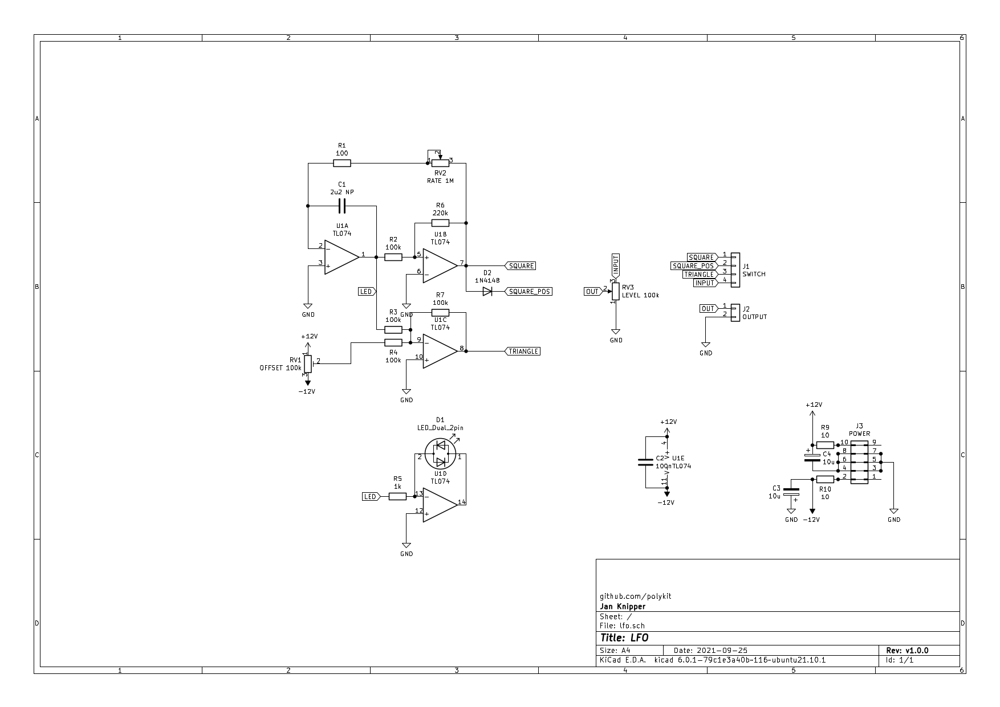

# LFO

This repository contains schematics and PCB layout for a LFO with pulse and triangle output. There are rate, level and offset controls on the board. I used this in the [Polykit-6 built](https://www.youtube.com/watch?v=vj-DSh6yfM0&t=424s) to control frequency cutoff, resonance and pulse width.

